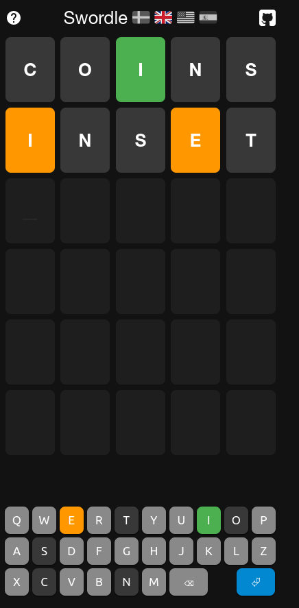
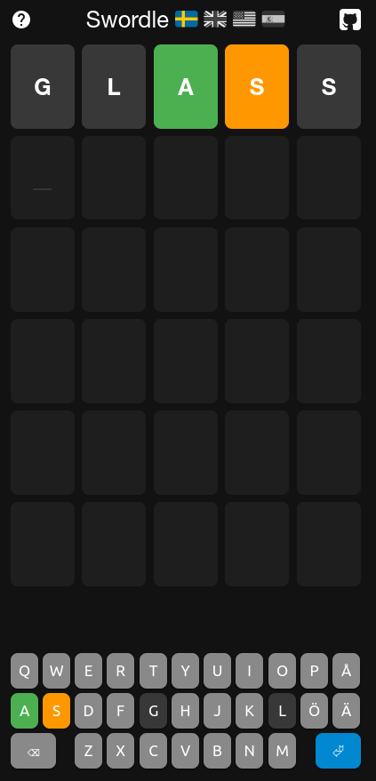
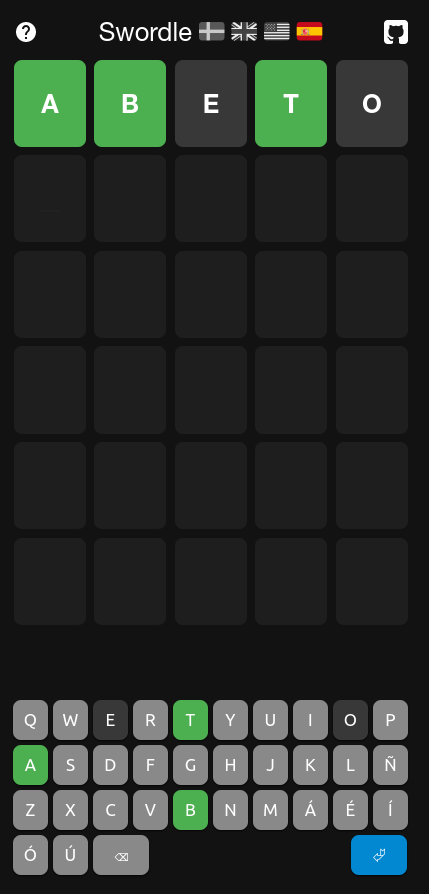

# Swordle

Swordle is a Swedish 🇸🇪 [Wordle](https://www.powerlanguage.co.uk/wordle) clone built by [@litenjacob](https://twitter.com/litenjacob) to be very smol. It's ~250 lines of JS and equally little CSS, and has [preact](https://preactjs.com) as its _only_ runtime dependency. It also uses [preact-cli](https://preactjs.com/cli/) to create a minimal, server-prerendered, offline-enabled [build](https://swordle.vercel.app/). Spela vackert! 🎉

## This Fork

Small modification of the original code to allow for different languages, each with their word dictionary and guess attempts. Uses local storage, same as the original, and provides a small script (inside `tools/` subfolder) to build the words from a Linux dictionary.

Some improvements can be done, like the dict script writing directly the words file, but as a quick hack to practice multiple languages.

The keyboard layout is modified to show all available characters, including those that normally wouldn't appear on a keyboard like Spanish accents.

Screenshots:

